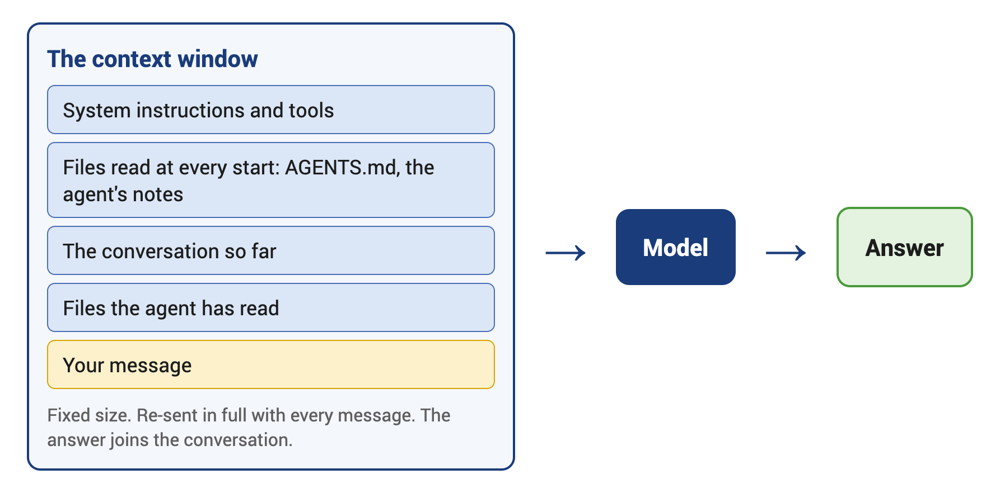

# Week 2 · Monday: How Language Models Work

What the model behind the agent is, why it sounds sure when it is wrong, and how to read your own usage.

## 1. How the model was made

| Stage | What happens | What it leaves behind |
|---|---|---|
| Pre-training | Reads a large part of the internet, learns to predict the next word | A vague recollection, up to a cutoff date. Nothing about you |
| Post-training | Taught to be an assistant from example conversations | Follows instructions |
| Human ratings | Answers raters prefer are rewarded | Fluent and confident, right or wrong |

- All three happened once, at the company that made the model, and are frozen. What you can change reaches the model through the context window.

> [!IMPORTANT]
> **KEY POINT:** Tone tells you nothing. A hallucination is a fluent, specific, wrong statement, produced the same way as a right one. Check every number, name, date and source.

## 2. The harness

- The program around the model: its own instructions, tools, a loop and permission prompts. Almost nobody talks to a model directly.
- Chat websites, agents on your machine, Copilot inside Excel, a company's own chatbot: all harnesses around the same few models. Same model, different harness, different results.

## 3. Model, chatbot, agent

- The model alone: text in, text out.
- A chatbot: the model plus a few fixed tools: web search, file upload, a code runner, memory.
- An agent: the model plus tools on your machine, in a loop until the task is done. It adds tools as needed. Permissions set how far it goes alone.

## 4. The context window



- Everything the model can see when it answers. Nothing else exists for it.
- Fixed size, in tokens: about three quarters of an English word. Greek costs more tokens per word.
- Re-sent in full with every message. A long conversation costs more and answers worse. The limit is not the target.

## 5. Reading your own usage

| Command | What it does |
|---|---|
| `/usage` | How much of your Pro limit is used, and when it resets |
| `/context` | What fills the context window right now |
| `/statusline` | Sets up the bar at the bottom: model, folder, how full the context window is |
| `/model` | Which model answers. Left and right arrows set the effort level |

- After an hour without a message, the whole conversation is paid for again. Short conversations, one task each.

## In class

1. Open a terminal in the `bpa347` folder on the Desktop and start the agent.
2. Set up the status line. Approve the write to its settings file. The bar appears at the bottom.
   ```prompt
   /statusline show the model, the folder I am in, and how full the context window is, as a percentage
   ```
3. Look at the context window before you have asked anything. Note the total.
   ```prompt
   /context
   ```
4. Ask one question about the data. It writes and runs a Python program; approve.
   ```prompt
   Which five countries outside the UK had the highest revenue in November 2025?
   ```
5. Look again and compare with step 3.
   ```prompt
   /context
   ```
6. Check the model. Left and right arrows show the effort levels. Escape closes it.
   ```prompt
   /model
   ```
7. See how much of your limit is used.
   ```prompt
   /usage
   ```

## Terms

- **Token**: the unit the model reads and writes; about three quarters of an English word.
- **Context window**: everything the model can see when it answers. Fixed size; re-sent in full with every message.
- **Hallucination**: a fluent, specific, wrong statement, produced the same way as a right one.
- **Harness**: the program around the model: its tools, the loop, the permission prompts.

## Homework

Before Thursday: one read-only question to the agent about your own computer. See [homework](homework.md).
