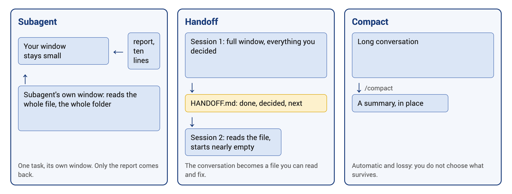

# Week 2 · Thursday: Context Engineering

Everything the model knows about you arrives through the context window. What to put there, and three ways to keep it small.

## Before class

- Your homework question and its answer, ready to show
- Your laptop, with the `bpa347` folder from week 1

## 1. The context window is all the model knows about you

- Nothing about you, your company, your data or your decision is in the context window until something puts it there.
- When something is missing, the model guesses or asks. A guess you check afterwards. A question you answer.

> [!IMPORTANT]
> **KEY POINT:** The answer is only as good as the context window at that moment. Filling it is your job.

## 2. A briefing has five parts

| Part | Says | Usually in |
|---|---|---|
| Role and audience | Who asks, who reads the result | the file |
| Goal and decision | What the result is for, what it decides | the message |
| Constraints and format | Length, language, units, layout | both |
| Materials and examples | The files, the data, what good looks like | both |
| Success criteria | How you will judge the result | the message |

- What never changes goes in the file, once. What belongs to this task goes in the message.

## 3. Three sources, read at every start

| Source | Who writes it | How long it lasts |
|---|---|---|
| Your message and the conversation | You and the agent | Saved locally; can be resumed |
| Files in the folder, including the briefing file | You, once | Until you delete them |
| Its own notes | The agent, as it works | Until you or it edits them |

- The briefing file holds what you would otherwise repeat every session, like the [briefing in the kit](https://bpa347-notes.vercel.app/kit/AGENTS.md). Edits apply at the next start.
- Claude Code: the briefing file is `CLAUDE.md`.
- Codex: the briefing file is `AGENTS.md`.

## 4. Three ways to keep the context window small



- **Subagent**: a second copy of the model with its own context window, doing one task. Only its report comes back. Ask in plain words: "use a subagent to".
- **Handoff**: the agent writes a file: what was done, what was decided, what is next. Exit, start fresh, point the agent at the file.
- **Compact**: `/compact` replaces the conversation with a summary. Detail is lost, and you do not choose what survives.

## In class

1. Make a folder on the Desktop named `bpa347-week2` and open a terminal there. Windows: right-click on empty space, **Open in Terminal**. Mac: right-click the folder, **New Terminal at Folder**. Start your agent with the command for your tool.

   Claude Code:
   ```bash
   claude
   ```

   Codex:
   ```bash
   codex
   ```
2. Bring the data file over. Approve the read outside its folder.
   ```prompt
   Copy online_retail.csv from the bpa347 folder on my Desktop into this folder.
   ```
3. Ask the question. Look at how the table and the chart come out.
   ```prompt
   Revenue by month for 2025: a table, and a bar chart saved as an HTML file.
   ```
4. Create the briefing file. Use the prompt for your tool.

   Claude Code:
   ```prompt
   Create a file named CLAUDE.md in this folder with exactly these five lines:
   - Tables in markdown, with a totals row.
   - Money in GBP with the £ sign and thousands separators, no decimals.
   - Charts: one HTML file per chart, with a title and axis labels.
   - Exclude cancelled invoices (InvoiceNo starting with C) and zero prices, and say so under every table.
   - End every answer with one sentence: what I should check by hand.
   ```

   Codex:
   ```prompt
   Create a file named AGENTS.md in this folder with exactly these five lines:
   - Tables in markdown, with a totals row.
   - Money in GBP with the £ sign and thousands separators, no decimals.
   - Charts: one HTML file per chart, with a title and axis labels.
   - Exclude cancelled invoices (InvoiceNo starting with C) and zero prices, and say so under every table.
   - End every answer with one sentence: what I should check by hand.
   ```
5. Restart the agent. Type `/exit`, then run the command for your tool in the same terminal.

   Claude Code:
   ```bash
   claude
   ```
   Then type the command below and check that `CLAUDE.md` appears under Memory files.
   ```prompt
   /context
   ```

   Codex:
   ```bash
   codex
   ```
   Then ask which instructions it loaded.
   ```prompt
   Which instruction files did you load for this folder, and what rules do they contain?
   ```
   Check that its answer includes the five rules from `AGENTS.md`.
6. Ask the question from step 3 again, word for word. Compare.
7. Practise reopening the same conversation. Type `/exit`, then run the command for your tool in the terminal, in the same folder. It continues the most recent saved conversation from that folder. It does not start a fresh context window.

   Claude Code:
   ```bash
   claude -c
   ```

   Codex:
   ```bash
   codex resume --last
   ```
   Check that your previous messages are back. To choose an older conversation instead, use the command for your tool below.

   Claude Code:
   ```bash
   claude --resume
   ```

   Codex:
   ```bash
   codex resume
   ```
8. The subagent. Watch the status line: the context window grows very little or not at all, because the subagent does the work in a context window of its own and returns only its answer.
   ```prompt
   Use a subagent to check the CSV for data problems and report back in ten lines.
   ```
9. The handoff. Note the percentage on the status line, ask for the file, then type `/exit`.
   ```prompt
   Write a file named HANDOFF.md: what we did today, what we decided, what is next, and anything you would want to remember in a fresh session on this project. Short.
   ```
10. Start a fresh conversation, without the resume option.

    Claude Code:
    ```bash
    claude
    ```

    Codex:
    ```bash
    codex
    ```

    Continue from the file using the prompt below. Compare the percentage with step 9.
    ```prompt
    Read HANDOFF.md and tell me where we are.
    ```

## Terms

- **Briefing file**: a text file the agent reads at every start in a folder. `CLAUDE.md` for Claude Code, `AGENTS.md` for Codex.
- Claude Code: **Auto memory** means notes the agent writes for itself about you and the project, read at every start. `/memory` opens them.

## Homework

Before Monday: the handoff again at home, on a conversation of your own. See [homework](homework.md).
